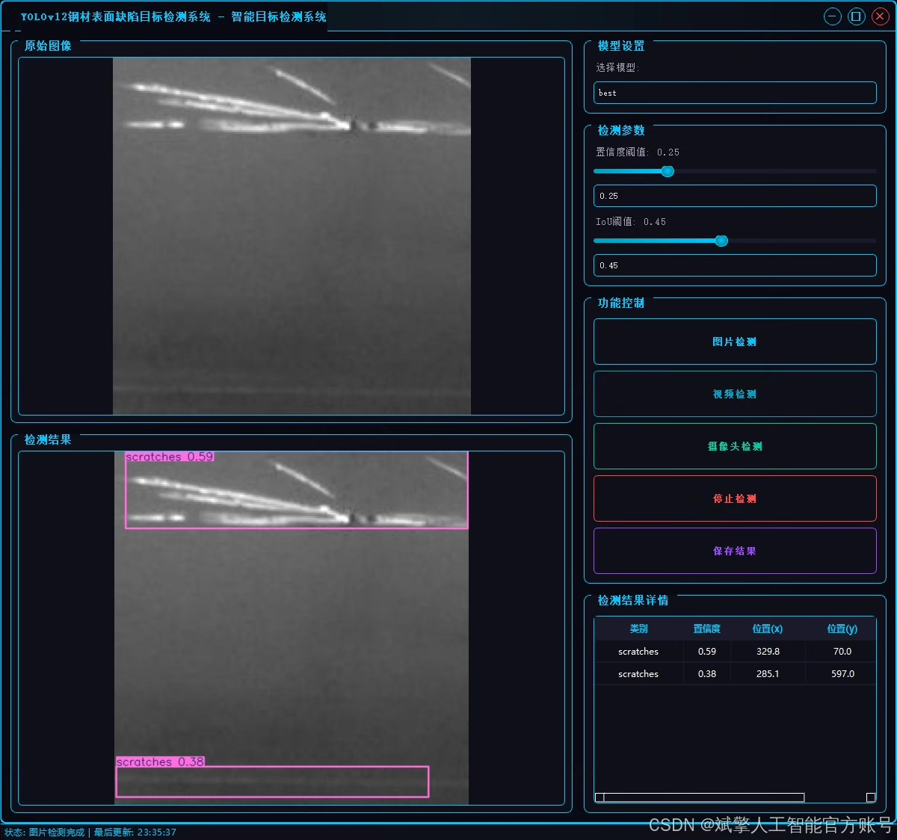
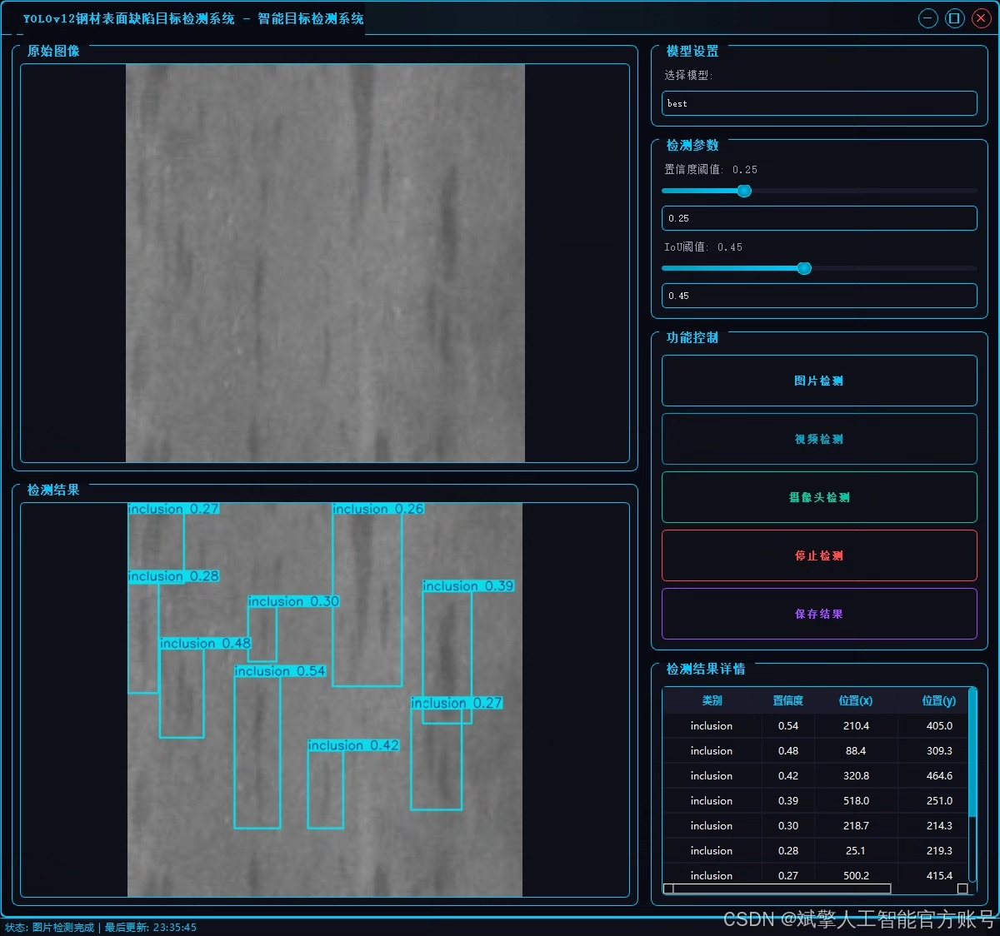
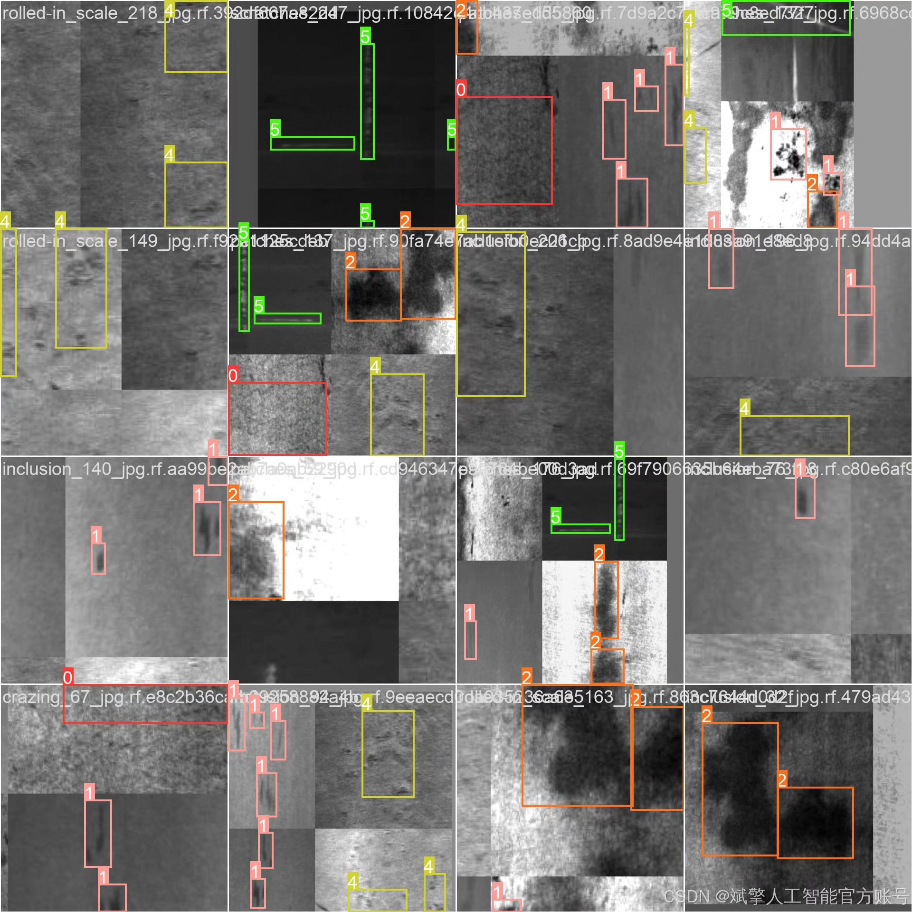
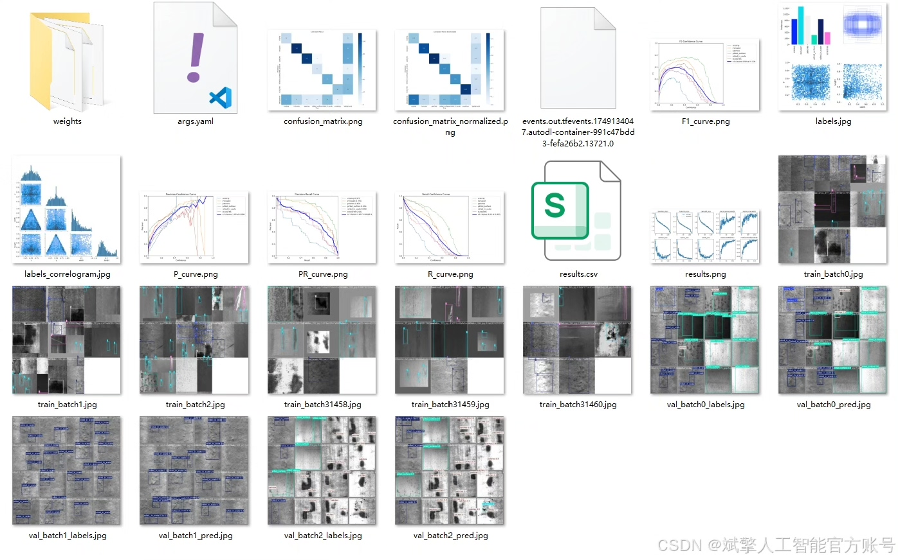
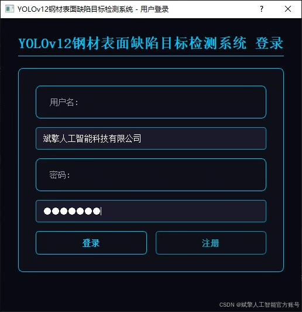
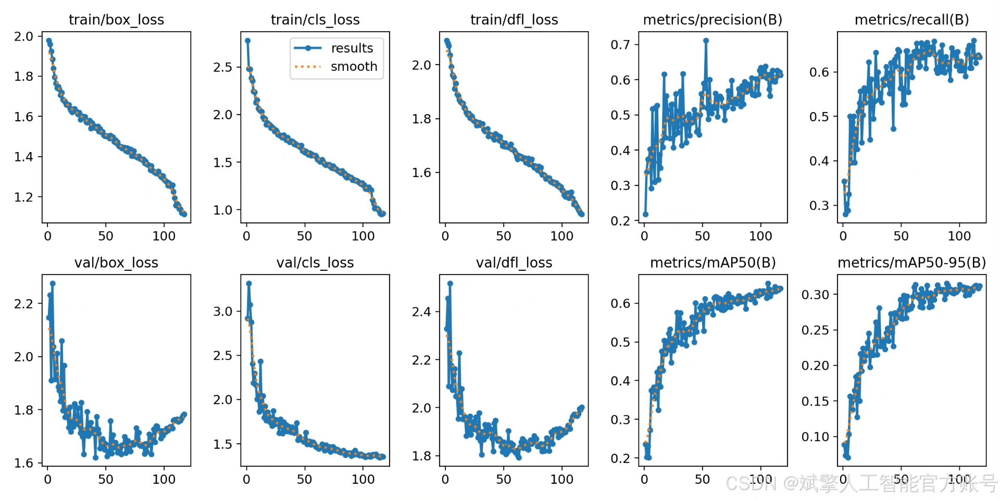
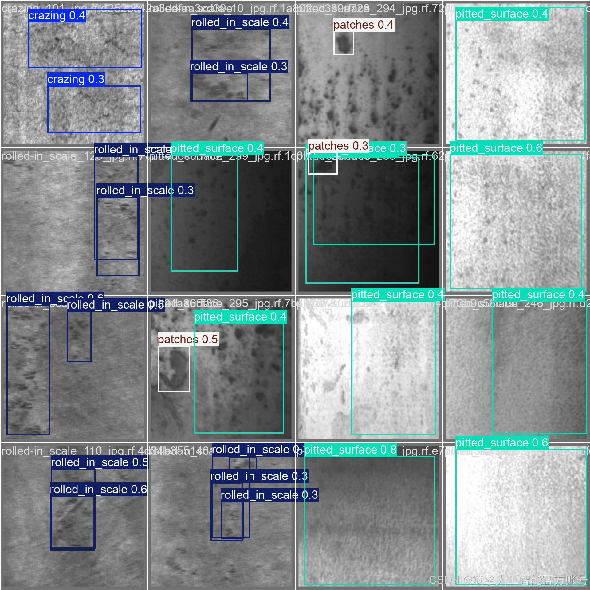

# YOLOv12 Steel Defect Detection System

## Body

YOLOv12 Steel Defect Detection System Based on Deep Learning YOLOv12: A Steel Surface Defect Detection System (YOLOv12+YOLO dataset + UI interface + login and registration interfaces + Python project source code + model)

Steel surface defect detection is a critical aspect of industrial quality control. Traditional detection methods rely on manual or simple image processing techniques, which are inefficient and have high false-positive rates. This paper constructs an efficient and accurate steel surface defect detection system based on the deep learning target detection algorithm YOLOv12. The system utilizes a YOLO format dataset containing six types of defects (crazing, inclusion, patches, pitted surface, rolled in scale, scratches), with a total of 2352 training images, 295 validation images, and 113 test images. The system integrates a user-friendly UI interface that supports login and registration functions, enabling real-time detection and classification of defects.

✅ User Login and Registration: Supports password verification and security validation.
✅ Three Detection Modes: Based on the YOLOv12 model, supporting image, video, and real-time camera detection, accurately identifying targets.
✅ Dual-Screen Comparison: Displaying the original image and detection results on the same screen.
✅ Data Visualization: Real-time table displaying the category, confidence, and coordinates of detected targets.
✅ Intelligent Parameter Tuning: Offers a confidence slide bar for dynamic optimization of detection accuracy to meet different scene requirements.
✅ Sci-Fi Interactive Interface: Dark theme paired with dynamic light effects to reduce visual fatigue and enhance operational experience.

## Images

## Payment

Here is a pay link on Stripe ( https://buy.stripe.com/3cs8yP7sY87d0vu9AB ). Please contact me lonlonago@foxmail.com after funding $89, and I will send you a complete data files , thank you!

